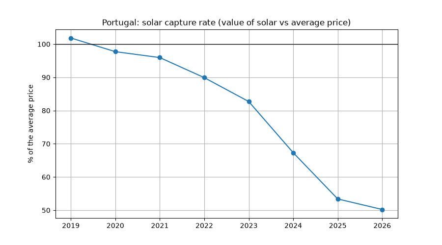

# Portugal Electricity Tracker

Wholesale electricity prices and production by source in Portugal, updated automatically every day.

**Live app:** [portugal-electricity-tracker.streamlit.app](https://portugal-electricity-tracker.streamlit.app/)

The app shows tomorrow's hourly prices with the cheapest hours, where today's electricity came from, and how the growth of wind and solar has changed prices since 2019.

## Main findings (2019 to 2026)

| Finding | Result |
|---|---|
| Average price when wind and solar cover less than 10% of consumption | about 113 €/MWh |
| Average price when wind and solar cover more than 80% of consumption | about 15 €/MWh |
| Solar capture rate (value of solar energy compared with the average price) | 102% in 2019, about 50% in 2026 |
| Hours with a price at or below 1 €/MWh (close to zero) | 19 in 2019, 1,190 so far in 2026 |
| Hours with a negative price | none until 2023, 541 so far in 2026 |
| Effect of one extra percentage point of wind and solar | price falls by about 0.94 €/MWh |
| Effect of one extra GW of demand | price rises by about 8 €/MWh |

The last two results come from a regression of the hourly price on the share of wind and solar, the share of hydro, demand and the year (about 68,000 hours since 2019, R² of 0.49, HAC standard errors).





## Data

* **Prices:** REN DataHub API (hourly, 2019 to June 2026) and OMIE day-ahead market files (from July 2026 until tomorrow). Both are in Spanish time and were converted to Portuguese time. REN and OMIE prices match (difference under 0.2%).
* **Production:** REN DataHub API, 15 minute values for 15 sources (hydro, wind, solar, natural gas, biomass, imports, exports, pumping, batteries and others), converted to hourly averages.

## How it works

1. `notebooks/01_test_ren_api.ipynb` tests the REN API and the OMIE files.
2. `notebooks/02_download_history.ipynb` downloads the history since 2019.
3. `notebooks/03_build_database.ipynb` cleans the data, converts it to hourly values in Portuguese time and saves it in `data/prices_hourly.csv` and `data/production_hourly.csv`.
4. `notebooks/04_analysis.ipynb` loads the CSV files into a SQLite database and does the analysis with SQL and Python (merit order, duck curve, solar capture rate, hours with near zero and negative prices, regression).
5. `update_data.py` downloads the newest OMIE prices and REN production and adds them to the CSV files. GitHub Actions runs it every day (`.github/workflows/daily_update.yml`).
6. `app.py` is the Streamlit app, which reads the CSV files.

## Run it on your computer

```
pip install -r requirements.txt
streamlit run app.py
```

## Tools

Python (pandas, requests, matplotlib, statsmodels), SQL (SQLite), Streamlit, GitHub Actions.

## Author

José Nunes, economist. Personal project with public data from OMIE and REN; views are my own.
