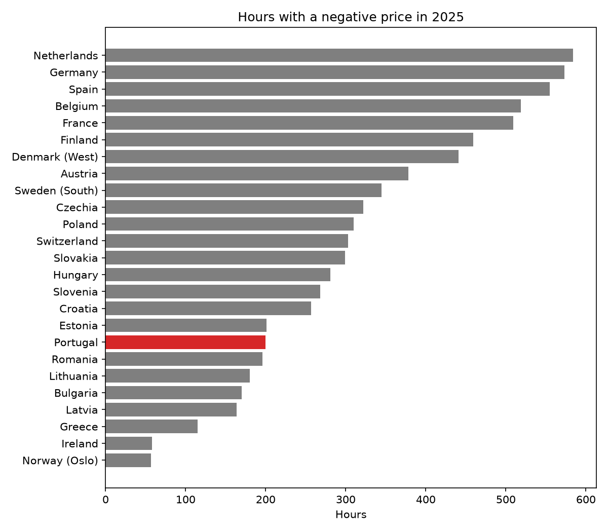
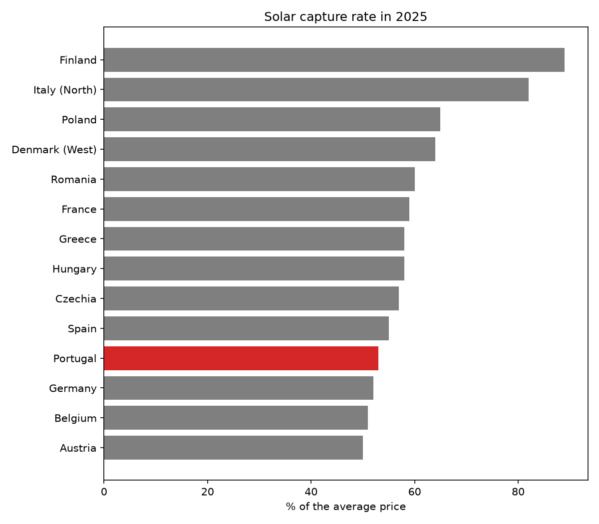
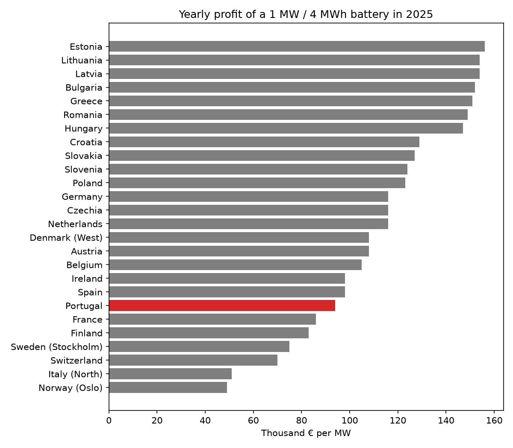
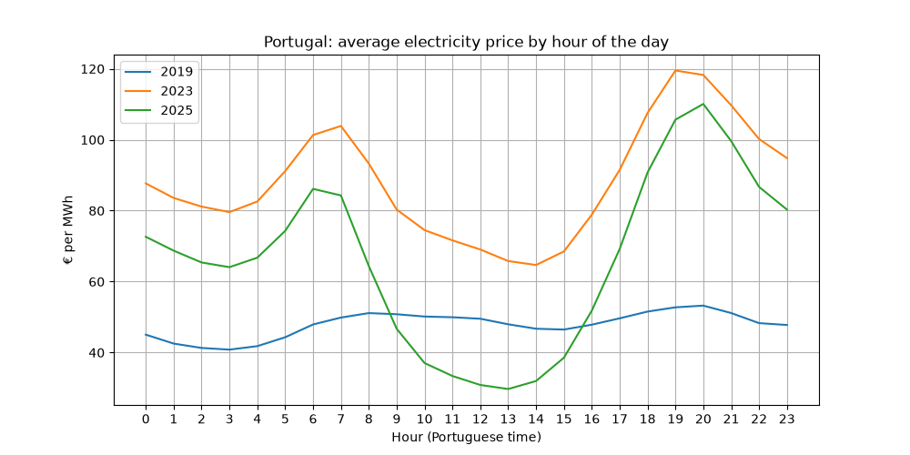
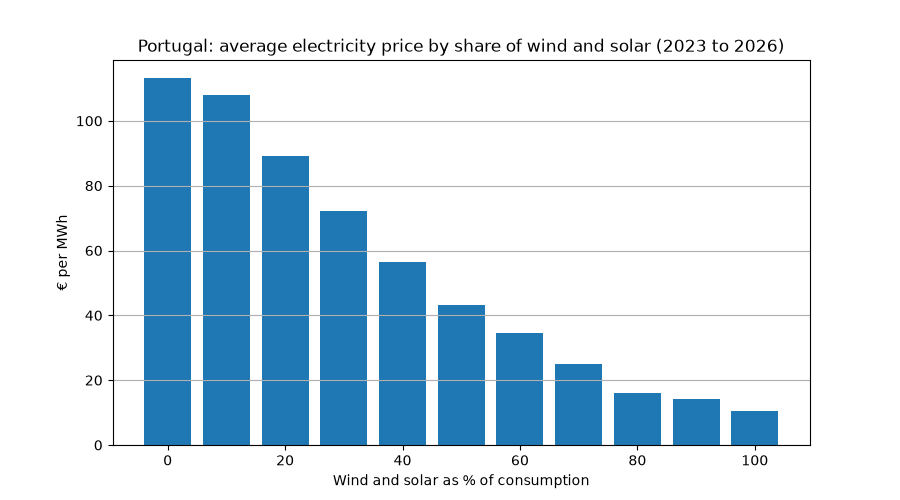

# European Electricity Tracker

Day-ahead electricity prices for 26 European markets, with a closer look at Portugal. Everything updates by itself every afternoon, as soon as tomorrow's prices are out.

**Live app:** [european-electricity-tracker.streamlit.app](https://european-electricity-tracker.streamlit.app/)

## Why I built this

I work at ERSE, Portugal's energy regulator, and the same topics keep coming up: negative prices, the duck curve, solar losing value, batteries. I wanted to see how big these effects really are, using public data and my own code. I started with Portugal and later extended it to the rest of Europe with the ENTSO-E API.

## What's in the app

* **Europe:** a map and a ranking of tomorrow's average price in each country, tomorrow's prices hour by hour for the countries you pick, and the main numbers for 2025.
* **Portugal:** tomorrow's hourly prices and the cheapest hours, where the electricity came from on the latest day, and how wind and solar have changed prices since 2019.
* **Batteries:** how much a battery would earn by charging in the cheapest hours and selling in the most expensive ones.

## What I found

### Across Europe

| | Result |
|---|---|
| Cheapest and most expensive market in 2025 | Finland at 41 €/MWh, Northern Italy at 116 €/MWh |
| Portugal in 2025 | 66 €/MWh, 6th cheapest of 26 |
| Hours with a negative price, all 26 markets added up | 829 in 2019, 7,744 in 2025 |
| Most negative hours in 2025 | Netherlands (584), Germany (573), Spain (555) |
| Solar capture rate | 92% to 113% in 2019, 50% to 65% in 2025 in most countries |
| Yearly profit of a 1 MW / 4 MWh battery in 2025 | about 155 thousand € in the Baltics, about 50 thousand € in Norway and Northern Italy |

The pattern is the same almost everywhere. Solar panels all produce at the same time, so the more solar a country builds, the lower its midday prices go. That cuts what solar earns and widens the gap between midday and evening, which is exactly what a battery makes money on. Northern Italy and Finland are the exceptions, with solar still earning over 80% of the average price.







### Portugal (2019 to 2026)

| | Result |
|---|---|
| Average price when wind and solar cover less than 10% of consumption | about 113 €/MWh |
| Average price when wind and solar cover more than 80% of consumption | about 15 €/MWh |
| Solar capture rate | 102% in 2019, about 50% in 2026 |
| Hours with a price at or below 1 €/MWh | 19 in 2019, about 1,200 by October 2026 |
| Hours with a negative price | none until 2024, more than 500 by October 2026 |
| One extra percentage point of wind and solar | price falls by about 0.94 €/MWh |
| One extra GW of demand | price rises by about 8 €/MWh |
| Yearly profit of a 1 MW / 4 MWh battery | about 9 thousand € in 2019, about 130 thousand € at the 2026 pace |

The two effects in the middle come from a regression of the hourly price on the share of wind and solar, the share of hydro, demand and year fixed effects (about 68,000 hours, R² of 0.49, Newey-West standard errors).





## Data

* **ENTSO-E Transparency Platform**, through the `entsoe-py` package: hourly day-ahead prices for 26 bidding zones since 2019, and solar, wind and consumption for the 15 largest. Stored in UTC.
* **OMIE**: day-ahead prices for Portugal from July 2026 on, from the market's daily files.
* **REN DataHub API**: Portuguese prices from 2019 to June 2026, and production by source every 15 minutes.

A few choices worth knowing:

* Countries split into several market zones are shown with one of them: Northern Italy, Western Denmark (DK1), Stockholm (SE3) and Oslo (NO1). Germany includes Luxembourg.
* Dutch solar is left out of the solar analysis, because ENTSO-E only has a small part of it. Finnish and Polish solar only count from the years they were reported.
* Ireland has gaps in the ENTSO-E data, so some days it doesn't show up on the map.
* REN, OMIE and ENTSO-E give the same Portuguese prices. I checked them against each other before putting them together.

## How it works

1. `notebooks/01_test_ren_api.ipynb`: first tests of the REN API and the OMIE files.
2. `notebooks/02_download_history.ipynb`: downloads the Portuguese history since 2019.
3. `notebooks/03_build_database.ipynb`: cleans it, moves everything to Portuguese time (clock changes included) and saves `data/prices_hourly.csv` and `data/production_hourly.csv`.
4. `notebooks/04_analysis.ipynb`: loads the CSV files into SQLite and does the Portuguese analysis with SQL and Python (merit order, duck curve, solar capture rate, negative prices, regression, battery value).
5. `notebooks/05_test_entsoe.ipynb`: tests the ENTSO-E API and checks its Portuguese prices against OMIE.
6. `notebooks/06_download_europe.ipynb`: downloads prices and production for Europe since 2019.
7. `notebooks/07_build_europe.ipynb`: puts everything into `data/europe_prices.csv` and `data/europe_production.csv`.
8. `notebooks/08_europe_analysis.ipynb`: price ranking and negative hours with SQL, solar capture rate and battery value by country, and the 2025 summary.
9. `update_data.py` and `update_europe.py` add the newest days. GitHub Actions runs both every afternoon (`.github/workflows/daily_update.yml`) and commits the new data.
10. `app.py` is the Streamlit app. It only reads the CSV files.

## Limits

* The battery numbers are an upper bound. The battery buys in the 4 cheapest hours and sells in the 4 most expensive without checking that it charges before it discharges, and network tariffs, wear and other markets are left out.
* The solar capture rate uses market prices only, without subsidies, contracts or curtailment.
* The Portuguese regression shows strong associations, not a clean causal effect. It leaves out the daily gas price and hour and month effects.

## Run it yourself

```
pip install -r requirements.txt
streamlit run app.py
```

The app only needs the CSV files in `data`. To download new European data you need a free ENTSO-E API token, saved in a file called `entsoe_token.txt`. That file is in `.gitignore`, so it never goes to GitHub.

## References

Data

* ENTSO-E Transparency Platform: [transparency.entsoe.eu](https://transparency.entsoe.eu/). Data published under Regulation (EU) No 543/2013.
* OMIE, day-ahead market results: [omie.es](https://www.omie.es/en/market-results)
* REN DataHub: [datahub.ren.pt](https://datahub.ren.pt/)
* entsoe-py, the Python client for the ENTSO-E API: [github.com/EnergieID/entsoe-py](https://github.com/EnergieID/entsoe-py)

Background

* Sensfuß, F., Ragwitz, M. and Genoese, M. (2008). The merit-order effect: A detailed analysis of the price effect of renewable electricity generation on spot market prices in Germany. *Energy Policy*, 36(8), 3086-3094.
* Hirth, L. (2013). The market value of variable renewables: The effect of solar wind power variability on their relative price. *Energy Economics*, 38, 218-230.
* Newey, W. K. and West, K. D. (1987). A simple, positive semi-definite, heteroskedasticity and autocorrelation consistent covariance matrix. *Econometrica*, 55(3), 703-708.

## Tools

Python (pandas, requests, matplotlib, statsmodels, entsoe-py), SQL (SQLite), Streamlit, Plotly, Altair, GitHub Actions.

## Author

José Nunes. Personal project using public data. Views are my own.
